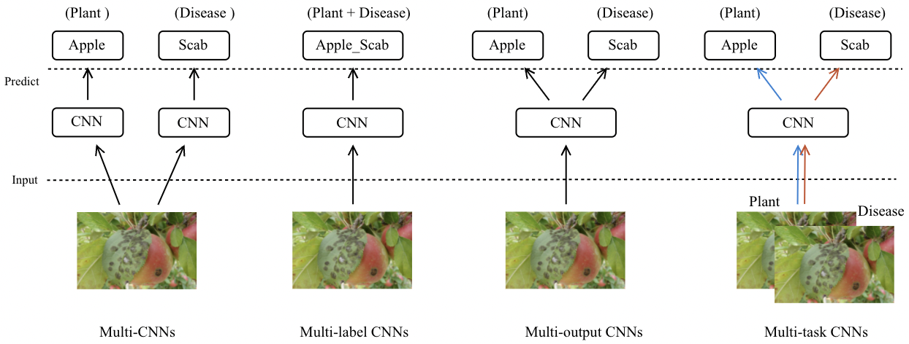
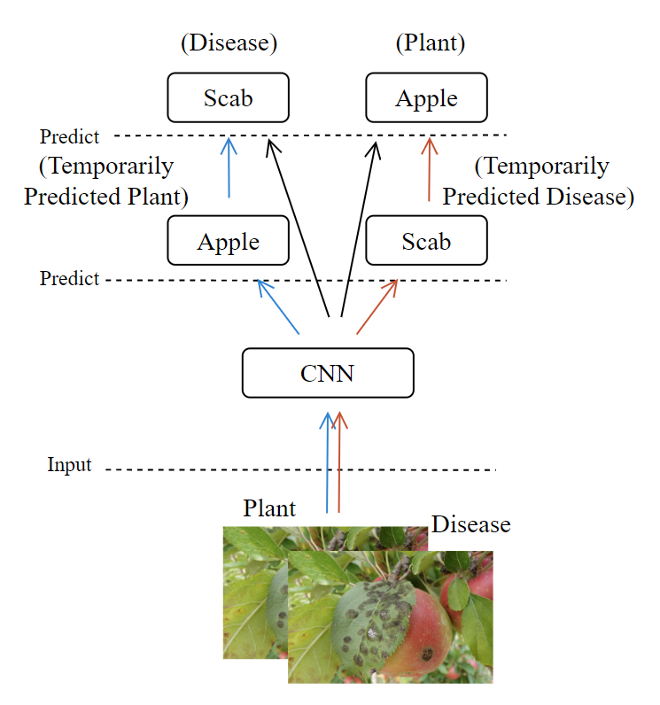

# Plant Pathology Deep Learning

This is the code for paper "Deep Learning for Plant Identification and Disease  Classification from Leaf Images: Multi-prediction Approaches".

**Abstract**: Deep learning has been playing an important role in modern agriculture, especially in plant pathology using leaf images where convolutional neural networks (CNN) are attracting a lot of attention. In this paper, we start our study by surveying current deep learning approaches for plant identification and disease classification. We categorise the approaches into multi-model, multi-label, multi-output, and multi-task, in which different backbone CNNs can be employed. Furthermore, based on the survey of existing approaches in plant pathology and the study of available approaches in machine learning, we propose a new model named Generalised Stacking Multi-output CNN (GSMo-CNN). To investigate the effectiveness of different backbone CNNs and learning approaches, we conduct an intensive experiment on three benchmark datasets Plant Village, Plant Leaves, and PlantDoc. The experiment results demonstrate that InceptionV3 can be a good choice for a backbone CNN as its performance is better than AlexNet, VGG16, ResNet101, EfficientNet, MobileNet, and a custom CNN developed by us. Interestingly, there is empirical evidence to support the hypothesis that using a single model for both tasks can be comparable or better than using two models, one for each task. Finally, we show that the proposed GSMo-CNN achieves state-of-the-art performance on three benchmark datasets.

## Approaches and our method
CNNs approaches for plant identification and Disease classification:

  

Our New Model Structure:

  

## Requirements
* Python >= 3.7
* h5py = 3.1.0
* Matplotlib = 3.5.1
* Numpy = 1.19.2
* opencv-contrib-python = 4.5.5.64 
* opencv-python = 4.5.5.64
* Pandas = 1.4.2
* scikit-learn = 1.0.2
* tensorflow-gpu = 2.4.1 or 2.6.0
* Imutils = 0.5.4
* PyTorch = 1.11.0
* torchvision = 0.12.0

## Usage
Please modify the parameters in `main.py`, then run `python main.py`.

## Parameters in main.py
| Parameter                      | Description                                 |
| ----------------------------- | ---------------------------------------- |
| `dataset_dir`                     | The path of the dataset, e.g., `/home/user/Leaf_diseases/Datasets/`. |
| `save_path`                     | The path of results and model will be saved, e.g., `/home/user/Leaf_diseases/test_model/` |
| `item`                     |  Dataset name, Options: `plant_village`, `plant_leaves`, `PlantDoc` & `PlantDoc_original`. |
| `obj`                     | Approach name, Options: `multi_model`, `multi_output`, `new_model`, `multi_label` & `cross_stitch`. |
| `model_name`   | backbone name, Options: `CNN`, `AlexNet`, `VGG`, `ResNet`, `EfficientNet`, `Inception` & `MobileNet`. |
| `saveornot`         | Save or Not save the results , Options: `save` & `not`. |
| `fig_size`                     | Fig size of the images, default=`256`. |
| `INIT_LR`                     | Learning rate, default = `0.001` |
| `op_z`                     | Optimizer, default = `Adamax`. |
| `TF_weights`                     | Transfer Learning weights, Options: `None` & `imagenet` |
| `bat_si`                     | Batch size, default = `16` |
| `epo`                     | Epoch, default = `10000` |
| `times `                     | The times’ amount of the model will run, default = `10` |
| `p_t_w `                     | The p_t weight of our new method, default = `0.1`  |
| `d_t_w `                     | The d_t weight of our new method, default = `0.1` |
| `p_w`                     | The p weight of our new method, default = `0.4` |
| `d_w `                     | The d weight of our new method,  default = `0.5` |
| `balance_weight` |  A list of the balance weight in our method, i.e., [p_t_w, d_t_w, p_w, d_w] |

